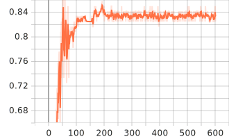

# Life Hack Set up Router Port Forwarding + etc

공유기 설정을 직접하는 것은 매우 귀찮은 일이다.
Login 과정만 해결한다면 쉽게 자동화할 수 있을텐데 캡챠의 등장! 하지만 직접 라벨링한 데이터 1200개로 CRNN 모델을 훈련시켜 이 문제를 해결했습니다.
만약 데이터셋이 필요하시다면 yoonhero06@naver.com으로 문의해주세요.
이 프로젝트의 주안점은 공유기의 캡챠를 푸는 것으로, 만약 추가적인 자동화 기능을 구현하여 API 제작을 하신다면 PR을 부탁드리겠습니다.

## How to install

1. Clone this Repository.
2. Download packages.. I might optimize the inference part for light user.
3. Edit `.env` file, your device setting (in `settings.py`), xpath selector??? (Plz Pull Request your device configuration.)
4. Run `router_automation.py` and wait for coffee.

## Captcha Solve

I used CRNN to predict captcha text. With CTC Loss, I could build pretty neat sequence modeling deep learning model. The final test acc nearly reach ~0.875. If you are planning to use this model for your project, please finger cross for remaining 0.125.

| Train Loss                      | Test Acc                     |
| ------------------------------- | ---------------------------- |
|  |  |

## Contribution

Welcome your PR.
